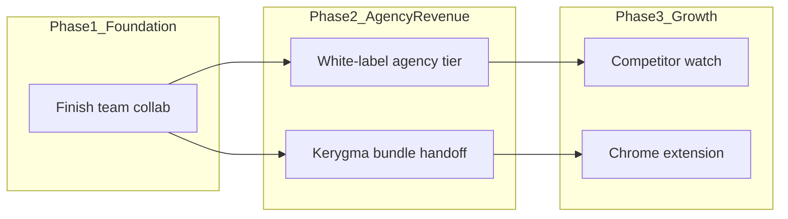

# Cadence — Feature Roadmap

**Last updated:** 2026-07-18  
**Purpose:** Internal reference for Cadence add-on features — what ships today, what’s missing, and recommended build order.  
**Scope:** Cadence (`ai-cmo`) only. Studio-wide integration lives in [GROWTH_STACK_PLAN.md](./GROWTH_STACK_PLAN.md). Social publishing split is in [KERYGMA_HANDOFF.md](./KERYGMA_HANDOFF.md).

---

## How to use this doc

- `[x]` = done (or done in repo; may still need production config)
- `[ ]` = not started
- `[~]` = in progress / partial
- **Owner** = which repo should build the work (`ai-cmo` = Cadence)

---

## Recommended build order

Based on existing scaffolding, revenue leverage, and infrastructure dependencies:

| Priority | Feature | Why this order |
|----------|---------|----------------|
| **1** | Team / workspace collaboration | Schema, API, and Settings UI already exist; finishing invites, authz, and comments unlocks agencies without new infra |
| **2** | White-label / agency tier | Extends Agency tab, SEO PDF reports, and campaign ZIP — highest revenue path on top of team collab |
| **3** | Content calendar / publishing | WordPress publish exists; social scheduling belongs on Kerygma — ship handoff + WP depth, not a Buffer clone |
| **4** | Competitor tracking & alerts | Crawler exists but needs cron workers, DB tables, and persistent notifications |
| **5** | Chrome extension | Greenfield top-of-funnel; depends on stable analyze API and auth/guest-trial story |

---

## 1. Team / workspace collaboration

**User value:** Agencies and small teams share brand profiles, comment on drafts, and control who can approve or publish — without exporting ZIPs back and forth.

### Current state

| Area | Status | Key files |
|------|--------|-----------|
| Organizations + agency fields | Shipped | `supabase/schema-v2-billing-teams.sql`, `server/routes/teams.ts` |
| Multi-brand client workspaces | Shipped | `src/lib/teamsApi.ts`, `src/components/BrandSwitcher.tsx` |
| Team invites (token generation) | Partial | `POST /api/teams/members/invite` — URL returned, no accept flow |
| Roles (`admin` / `editor`) | Partial | DB + UI; not enforced on API routes |
| Approval workflow | Partial | `src/components/AssetWorkspace.tsx` — local state in brand `payload` |
| Comments on drafts | Partial | Saved in `assetHistory`; no thread UI, not server-backed |

### Gaps

- [ ] **Invite acceptance** — `/app/settings?invite={token}` is generated but never handled
- [ ] **API authorization** — brand `GET`/`PUT` routes don’t verify org membership
- [ ] **Role enforcement** — `canApprove` not tied to role; admins not required for billing/org changes
- [ ] **Unified storage** — per-user `workspaces` row vs org-scoped `brands.payload` (dual model)
- [ ] **Comment threads** — render saved comments; persist in DB for teammates
- [ ] **Production schema** — confirm `schema-v2-billing-teams.sql` is run in Supabase (see GROWTH_STACK_PLAN Phase 0)

### Recommended approach

Build entirely in **Cadence**. No sister-product dependency. Finish the scaffold before marketing Team plan harder.

### Dependencies

- Run `supabase/schema-v2-billing-teams.sql` in production
- Align seat limits (`PLAN_LIMITS.team.seats` vs Stripe checkout `seats: 3`)
- Optional: email provider for invite links (or keep copy-link UX for v1)

### Phased checklist (Cadence-owned)

**Phase 1 — Invites & authz**

- [ ] `GET /api/teams/invite/accept?token=` — validate token, set `user_id` + `joined_at`
- [ ] Settings reads `?invite=` on load and calls accept endpoint
- [ ] Middleware: verify caller is org member for all `/api/teams/brands/*` routes
- [ ] Admin-only gates on org patch, member invite, billing actions

**Phase 2 — Shared workspace truth**

- [ ] On login: hydrate active brand from `brands.payload`, not parallel user `workspaces` blob
- [ ] Scope `campaign_runs` to `brand_id` (migration + API)
- [ ] Realtime or polling sync when two editors open same brand (v2)

**Phase 3 — Approval & comments**

- [ ] Render comment thread in AssetWorkspace from `assetHistory`
- [ ] Gate approval UI by plan (`approvalWorkflow`) and role (`admin` or explicit approver)
- [ ] Optional: `approval_comments` table for audit trail + notifications

---

## 2. White-label / agency tier

**User value:** Agencies deliver client-ready outputs under their own brand — PDF reports, campaign exports, and eventually a dedicated plan — without Cadence branding leaking into deliverables.

### Current state

| Area | Status | Key files |
|------|--------|-----------|
| Agency name + logo URL | Shipped | `src/components/settings/AgencyTab.tsx`, `server/routes/teams.ts` |
| White-label SEO audit PDFs | Shipped (Pro+) | `server/routes/reports.ts`, `server/lib/reportHtml.ts` |
| Campaign ZIP export | Shipped | `src/utils/exportCampaignBundle.ts` — filename `ai-cmo-{brand}-{date}.zip` |
| Team / Studio Bundle positioning | Shipped | `src/lib/bundles.ts`, `src/components/CadencePricingSection.tsx` |
| Dedicated “Agency” Stripe SKU | Not built | Agencies map to Team ($149/mo) or Studio Bundle ($199/mo) |

### Gaps

- [ ] Agency branding on campaign ZIP (filename, manifest, README)
- [ ] Remove or make optional Cadence footer in PDF reports (*“Prepared with Cadence”*)
- [ ] Logo upload (today: URL-only in Agency tab)
- [ ] Client portal or read-only share links for deliverables
- [ ] Optional Agency SKU or seat-based upsell in Stripe

### Recommended approach

Build in **Cadence** first (export + report branding). Cross-product “unified client report” (SEO + citations + social metrics) is a **Growth Stack** initiative — see GROWTH_STACK_PLAN and KERYGMA_HANDOFF agency white-label section.

### Dependencies

- Team collaboration (Section 1) for multi-seat agency workflows
- `whiteLabelReports` plan flag already in `server/lib/plans.ts`
- Stripe changes only if adding a distinct Agency product

### Phased checklist (Cadence-owned)

**Phase 1 — Deliverable branding**

- [ ] ZIP export uses `agency_name` in filename and `manifest.json` when org has agency fields set
- [ ] `reportHtml.ts`: configurable footer (agency-only vs co-branded)
- [ ] Agency logo upload to Supabase Storage (replace URL-only)

**Phase 2 — Agency packaging**

- [ ] Marketing + Billing: clarify Team vs “Agency” positioning (may stay Team SKU)
- [ ] Client-facing share link for SEO report PDF (signed URL, expiry)
- [ ] Gate white-label ZIP on Pro+ or Team (match PDF gating)

**Phase 3 — Growth Stack report (multi-repo)**

- [ ] CitePilot citation summary section in agency PDF (API)
- [ ] Kerygma social metrics per client brand (API) — **Kerygma-owned**
- [ ] Single cover page template — **Cadence-owned** HTML shell

---

## 3. Content calendar / publishing integration

**User value:** Close the loop from generated blog posts and social copy to scheduled publication — without copy-pasting into five different tools.

### Current state

| Area | Status | Key files |
|------|--------|-----------|
| WordPress publish (draft + live) | Shipped | `server/routes/publish.ts`, `src/utils/wordpressBlocks.ts` |
| Google Search Console + GA4 | Shipped | `server/routes/integrations.ts` |
| Local campaign calendar UI | Shipped | `src/components/CampaignCalendar.tsx`, `src/utils/calendarTasks.ts` — `localStorage` only |
| Asset scheduler UI | Mock only | `src/components/AssetWorkspace.tsx` — `setIsScheduled(true)`, no backend |
| Buffer / LinkedIn API | Not built | Marketing copy only; Settings integration cards are stubs |
| Kerygma bundle import | Spec only | `docs/KERYGMA_HANDOFF.md` — `POST /api/import/campaign-bundle` not built |

### Gaps

- [ ] Server-persisted calendar events (brand-scoped)
- [ ] Scheduled WordPress publish (cron or queue)
- [ ] Social scheduling in Cadence (explicitly **out of scope** — Kerygma owns)
- [ ] Campaign ZIP → Kerygma queue handoff

### Recommended approach

| Channel | Owner | Cadence role |
|---------|-------|--------------|
| Blog / WordPress | **Cadence** | Deepen WP publish + scheduled posts |
| Social (LinkedIn, X, Meta, etc.) | **Kerygma Social** | Export bundle or API handoff — do not rebuild Buffer |
| Manual / other CMS | **Cadence** | Keep meta-export + ZIP for paste workflows |

See [KERYGMA_HANDOFF.md](./KERYGMA_HANDOFF.md): *“Do not rebuild Kerygma’s scheduler inside AI-CMO.”*

### Dependencies

- Render cron worker or job queue for scheduled publish
- Kerygma: implement `POST /api/import/campaign-bundle` (**Kerygma-owned**)
- `integration_connections` table pattern for future OAuth providers

### Phased checklist

**Phase A — Cadence: WordPress + calendar persistence**

- [ ] `calendar_events` table (brand_id, asset_id, scheduled_at, channel, status)
- [ ] Sync `CampaignCalendar` to API (replace localStorage for cloud users)
- [ ] Cron: `POST /api/publish/wordpress` for due events
- [ ] Wire AssetWorkspace scheduler to real `calendar_events` rows

**Phase B — Kerygma handoff (cross-repo)**

- [ ] Cadence: “Send to Kerygma” button → upload ZIP or POST JSON manifest
- [ ] Kerygma: `POST /api/import/campaign-bundle` accepts posts + `brandUrl`
- [ ] Kerygma: map imported posts to queue drafts for approval

**Phase C — Optional direct integrations (low priority)**

- [ ] Buffer API — only if Kerygma handoff insufficient; prefer Kerygma
- [ ] LinkedIn API in Cadence — **non-goal** (Kerygma already publishes to LinkedIn)

---

## 4. Competitor tracking & alerts

**User value:** Ongoing watch on competitor URLs — re-crawl, detect meaningful changes, and alert when their SEO or messaging shifts.

### Current state

| Area | Status | Key files |
|------|--------|-----------|
| On-demand competitor compare | Shipped | `server/routes/seoIntel.ts` — `POST /api/seo-intel/competitor-compare` |
| Multi-page site crawler | Shipped | `server/seo/crawler.ts` |
| SEO Agent UI (Competitors tab) | Shipped | `src/components/SeoAgent.tsx` |
| Persistent competitor list | Not built | No DB table |
| Scheduled re-crawl | Not built | No cron workers on Render |
| Alert dispatch | Partial | Slack webhook on audit complete; server notifications are in-memory |

### Gaps

- [ ] `competitors` table (brand_id, url, label, last_crawled_at, snapshot hash)
- [ ] Scheduled crawl job (weekly/biweekly per plan)
- [ ] Diff detection (title, meta, H1, key content blocks)
- [ ] Persistent notification store (replace in-memory `server/routes/notifications.ts`)
- [ ] Email / Slack / in-app alert preferences per competitor

### Recommended approach

Build in **Cadence**. Reuse existing crawler and competitor-compare AI for diff summaries. Requires **infra prerequisite** (cron) before feature is production-ready.

### Dependencies

- Render cron service or external queue (Inngest, Trigger.dev, etc.)
- Supabase tables: `competitors`, `competitor_snapshots`, `alert_rules`
- Plan gating: competitor count by tier (Free: 0, Pro: 3, Team: 10 — TBD)

### Phased checklist (Cadence-owned)

**Phase 1 — Data model**

- [ ] Migration: `competitors`, `competitor_snapshots`
- [ ] CRUD API: add/remove/list competitors per brand
- [ ] UI: save competitor URLs from SEO Agent (not one-off compare only)

**Phase 2 — Scheduled watch**

- [ ] Cron worker: crawl competitor homepage + key pages
- [ ] Store snapshot; compute diff vs previous
- [ ] AI summary of changes via existing Gemini route pattern

**Phase 3 — Alerts**

- [ ] Persistent notifications table + user inbox API
- [ ] Dispatch: email, Slack webhook, in-app
- [ ] User prefs: `onCompetitorChange` in notification settings

---

## 5. Chrome extension

**User value:** Analyze any page the user is browsing — instant brand/SEO insights without copying URLs into Cadence.

### Current state

| Area | Status | Key files |
|------|--------|-----------|
| Browser extension | Not built | No `manifest.json` or extension directory |
| Brand analyze API | Shipped | Existing analyze flow used by onboarding |
| Guest trial (1× analyze) | Shipped | `server/lib/guestTrial.ts`, `signInAsGuest()` in AuthContext |
| Deep links | Partial | `docs/DEEP_LINKS.md` |

### Gaps

- [ ] MV3 extension project (popup + content script or side panel)
- [ ] Auth: Supabase session in extension or guest analyze with upgrade CTA
- [ ] “Save to brand” — deep-link to `/app` with analyzed URL pre-filled
- [ ] Chrome Web Store listing + privacy policy update

### Recommended approach

New **extension repo** or `extension/` folder in monorepo. Calls existing Cadence APIs. Guest trial is a viable v1 for anonymous “analyze this tab” with sign-up prompt.

### Dependencies

- Stable CORS / extension-friendly auth (chrome.identity or token handoff)
- Rate limits aligned with guest trial and plan tiers
- Team collab (Section 1) optional for “save to shared brand”

### Phased checklist (Cadence-owned)

**Phase 1 — MVP**

- [ ] Extension: read active tab URL + optional page text snippet
- [ ] `POST /api/analyze` (or lightweight `/api/analyze/page`) from extension
- [ ] Popup shows summary + CTA: “Open in Cadence” / “Sign up”

**Phase 2 — Authenticated**

- [ ] Supabase auth in extension (shared session or OAuth)
- [ ] “Save to [brand]” picker — calls brand switch + workspace sync
- [ ] Quick SEO checklist for current page (meta, H1, word count)

**Phase 3 — Distribution**

- [ ] Chrome Web Store publish
- [ ] Landing page mention + install link
- [ ] Firefox / Edge (optional, Chromium-compatible)

---

## Infrastructure prerequisites

These block multiple features above:

| Prerequisite | Blocks | Status |
|--------------|--------|--------|
| `schema-v2-billing-teams.sql` in production | Team collab, agency multi-brand | `[ ]` per GROWTH_STACK_PLAN |
| Render cron worker or job queue | Scheduled WP publish, competitor watch | `[ ]` — single web service today (`render.yaml`) |
| Persistent notification store | Competitor alerts, team activity | `[~]` — in-memory server store + client localStorage |
| Kerygma bundle import API | Social calendar handoff | `[ ]` — spec in KERYGMA_HANDOFF |

---

## Explicit non-goals

| Non-goal | Reason |
|----------|--------|
| Rebuild Buffer / Hootsuite in Cadence | Kerygma Social owns social scheduling and channel OAuth |
| LinkedIn / X / Meta publish APIs in Cadence | Same — hand off via campaign bundle or deep link |
| Full CRM or client billing per brand | Out of scope; agencies use Team plan + external tools |
| Custom domain / app white-label (rebrand cadence.biblefunland.com) | No codebase support; future enterprise discussion |

---

## Decision log

| Date | Decision | Rationale |
|------|----------|-----------|
| 2026-07-18 | Social publish stays on Kerygma | KERYGMA_HANDOFF overlap rule; Kerygma already has Meta, LinkedIn, X, Pinterest |
| 2026-07-18 | Team collab before white-label depth | Agency tier needs working invites, authz, and shared brands |
| 2026-07-18 | Competitor watch after cron infra | On-demand compare ships; ongoing watch needs scheduled jobs |
| 2026-07-18 | Chrome extension is Phase 3 growth | Top-of-funnel value but no dependency unblocks other revenue features |

---

## Related docs

- [GROWTH_STACK_PLAN.md](./GROWTH_STACK_PLAN.md) — studio-wide phases, auth, billing, cross-product links
- [KERYGMA_HANDOFF.md](./KERYGMA_HANDOFF.md) — campaign bundle import, publish split, agency report vision
- [HOW_TO_POST.md](./user-guide/HOW_TO_POST.md) — user-facing publish workflows today
- [SUPABASE_GUEST_TRIAL.md](./SUPABASE_GUEST_TRIAL.md) — anonymous sign-in for extension / try-free funnel
